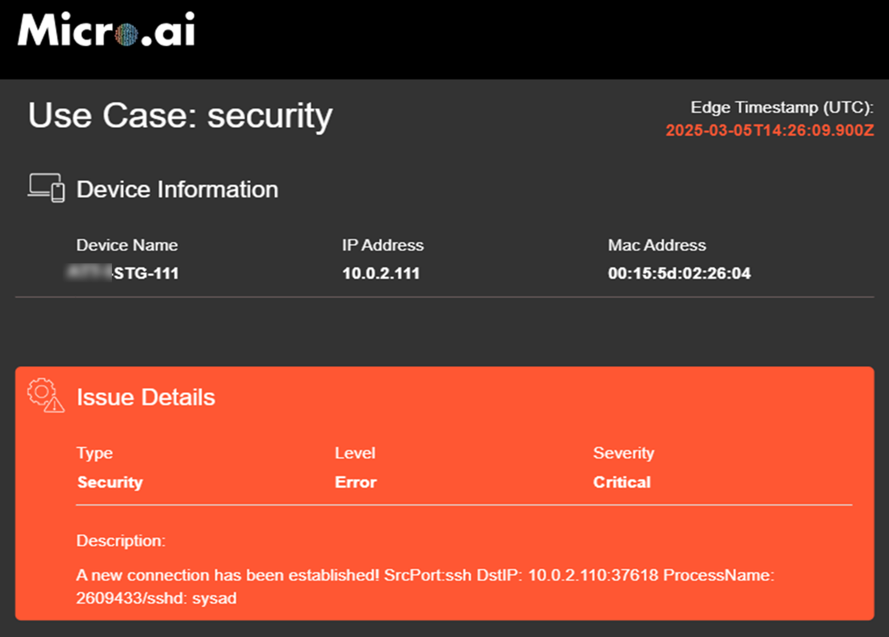
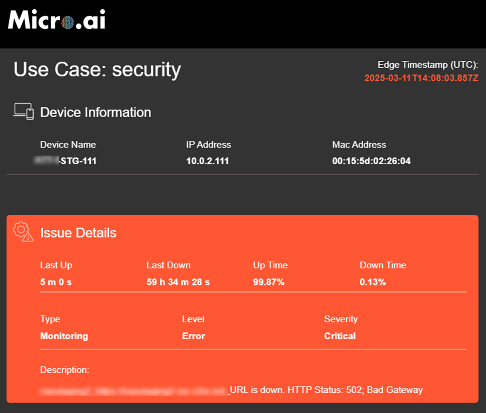
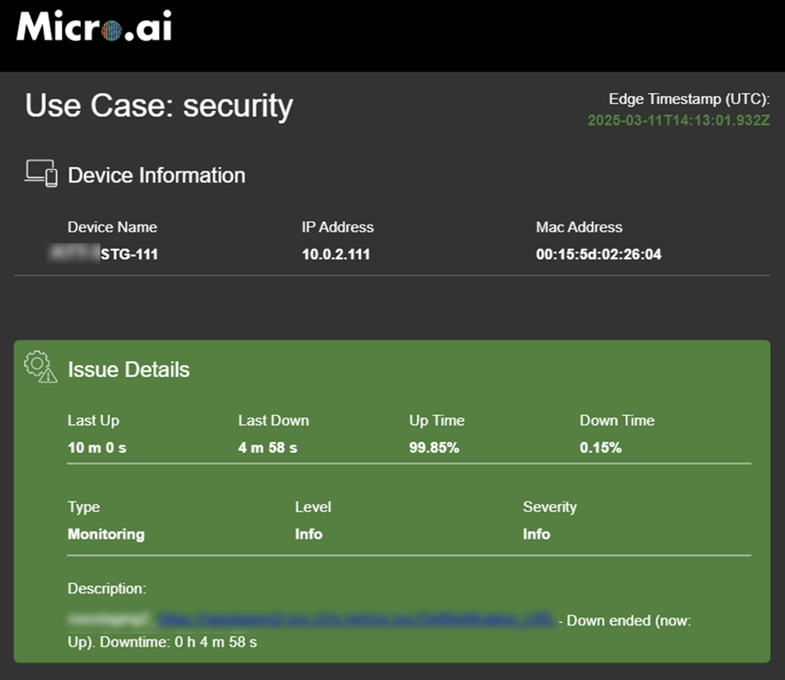

# Configurations
The following options allows you to configure your agent according to your needs. Updating this requires the agent to be restarted, and in some cases, retraining. **NOTE: provide details on where to find the config file for different OS**

## Table of Contents

- [Default configurations](#default-configurations)
- [Enabling Email Alerts](#enabling-email-alerts-for-security-events)
- [Exporter Configurations](#exporter-configurations)
- [Configure URL and Port Monitoring](#configure-url-and-port-monitoring)
- [All Configurations](#all-configuration-options)

## Default configurations

By default, the agent includes a preconfigured set of parameters. For example, the training duration is set to 3600 seconds (1 hour), and model building is disabled (IsBuildModel = False). This means that if no existing models are available, MicroAI will create new ones; otherwise, it will use the existing models. To generate new models, you can set IsBuildModel to True and adjust the training duration based on your environment and desired coverage period. For additional information on other configuration parameters, refer to the next section.

```json
{
  "General": {
    "Device": "Security",
    "FwVersion": "1.2.3",
    "APIkey": "<License Key>",
    "Activation_Base_Url": "https://cloud1-api.micro.ai",
    "Default_LAT": 32.88347,
    "Default_LON": -96.95822,
    "Location_Name":"Dallas",
    "Excluded_Internal_Ports":"443,80",
    "Excluded_External_Ports":"443,80"
  },
  "AI_general": {
    "TrainingSecs": 3600,
    "SplitCounter": 20,
    "AiFeedRate": 1000,
    "SmallThreshold": 0.01,
    "InitialPeriodSecs": 15,
    "HealthScoreDelay": 10,
    "BoundsLimit": false,
    "IsBuildModel": false
  },
  // ... continued fields ...
}
```

## Enabling Email Alerts for Security Events

The Email Notification Exporter enables the system to send automated email alerts based on predefined security events. Users can configure SMTP settings to integrate with their email servers and specify alert severity levels to control which notifications are sent. Alerts can be filtered based on severity levels ranging from Critical to Informational, ensuring that users receive only the most relevant notifications.

```json
{
  // ... other fields ...
  "Email_Notification_Exporter": {
    "smtp_host": "",
    "smtp_port": 587,
    "smtp_username": "",
    "smtp_password": "",
    "smtp_from_emailid": "",
    "smtp_to_email_list": "",
    "smtp_severity": "Critical, High"
  }
  // ... other fields ...
}
```
To enable email notifications, the system requires SMTP (Simple Mail Transfer Protocol) configuration. The following parameters must be defined:

### SMTP Configuration Parameters

- **`smtp_host`**: Specifies the SMTP server address that will handle outgoing emails.  
  *Example:* `smtp.mailserver.com`
- **`smtp_port`**: Defines the port used for SMTP communication. Common values include:
  - `587` (TLS encryption)
  - `465` (SSL encryption)
  - `25` (Unencrypted)
- **`smtp_username`**: The email address used to authenticate with the SMTP server.  
  *Example:* `admin@mailserver.com`
- **`smtp_password`**: The password associated with the SMTP username for authentication.

### Email Notification Details

The following parameters define how email notifications are sent and received:

- **`smtp_from_emailid`**: The sender's email address displayed in outgoing alerts.  
  *Example:* `alertsFrom@mailserver.com`
- **`smtp_to_email_list`**: A comma-separated list of recipient email addresses that should receive alerts.  
  *Example:* `it_team@mailserver.com,support@mailserver.com`

### Alert Severity Control

Users can customize email notifications based on the severity of alerts, ensuring that only relevant notifications are received. The `smtp_severity` parameter defines the severity levels of notifications to be sent. The available options are:

- **Critical** – Indicates urgent security threats that require immediate action.
- **High** – Represents significant security events that may impact system performance.
- **Medium** – Covers moderate security warnings that should be reviewed.
- **Low** – Includes minor alerts that may not require immediate attention.
- **Info** – Provides general system activity updates.

### Email Notification Alerts

To help users recognize MicroAI security alerts, below are sample screenshots of email notifications:

#### Critical Security Alert

The following screenshot shows a **Critical Security Alert** email from MicroAI, indicating a new SSH connection has been established. It includes device details such as name, IP address, and MAC address, along with issue details like type, level, and severity. This alert highlights a potentially unauthorized connection attempt.



#### High Severity Security Alert

The following screenshot displays a **High Severity Security Alert** email from MicroAI, reporting an abnormal process detection (`/usr/bin/python3.8 | ufw`). It includes device details (name, IP address, MAC address) and highlights a potential security risk related to unauthorized or suspicious process execution.


#### Critical Monitoring Alert

The following screenshot indicates a **Critical Monitoring Alert** triggered by a Bad Gateway (HTTP 502) error on `nasstaging2-ice.c2m.net_URL`.

**Key Details:**
- **Device:** ATT-STG-111
- **IP:** 10.0.2.111
- **Last Downtime:** 59h 34m 28s
- **Uptime:** 99.87%
- **Last Up:** 5m 0s ago



#### Informational Monitoring Alert

The following screenshot displays an **Informational Monitoring Alert** from MicroAI, indicating a temporary downtime on the `nasstaging2` service at `nasstaging2-ice.c2m.net`.

**Key Details:**
- **Device:** ATT-STG-111
- **IP:** 10.0.2.111
- **Last Downtime:** 4m 58s
- **Uptime:** 99.85%
- **Last Up:** 10m 0s ago



## Exporter Configurations

MicroAI supports various exporters to forward security events to remote systems. Users can configure these exporters based on their infrastructure:

```json
{
  // ... other fields ...
    "LaunchpadExporter": {
        "Enabled": false //enabling this requires Launchpad account
    },
    "ExternalExporter": {
        "ExternalExporterType": "off", //either http, redis or mqtt
        "Https_Post_Endpoint": "",
        "Output_Redis_Endpoint": "",
        "Output_MQTT": {
        "Endpoint": "127.0.0.1",
        "Port": 1884,
        "Username": "",
        "Password": "",
        "topic_prefix": "data/"
        }
    },
  // ... other fields ...
}
```

- **Launchpad Exporter:** Enabled to transmit data to Launchpad, this default exporter ensures you receive all security and monitoring data, including alerts, directly from the endpoint.
- **HTTP Exporter:** This exporter sends all data, including synchronous and asynchronous information, to a specified HTTP endpoint. It forwards comprehensive event data, enabling users to integrate with custom web applications, security information and event management (SIEM) systems, or other HTTP-based services. This ensures that both real-time and historical data can be transferred seamlessly across systems.
- **MQTT Exporter:** For systems utilizing MQTT messaging protocols, this exporter publishes all data, including both synchronous and asynchronous content, to an MQTT broker. This allows for the transmission of comprehensive event data. This method is ideal for lightweight, real-time messaging and is particularly well-suited for IoT-based applications and cloud-native systems that rely on MQTT for communication, enabling efficient data distribution across these environments.
- **Redis Exporter:** The Redis exporter pushes all data, including both synchronous and asynchronous information, into a Redis queue. Offering the flexibility to send complete event data. This is particularly useful for applications that require fast access to event data or for integrating with other Redis-based systems, like job queues or message brokers, ensuring efficient message handling and storage in high-throughput environments.
- **Built-in Prometheus metrics endpoint:** MicroAI Security includes a built-in Prometheus metrics endpoint to provide real-time system monitoring and health diagnostics. The endpoint, accessible via http://127.0.0.1:55001/metrics, exposes key system telemetry in a Prometheus-compatible format, allowing integration with monitoring and alerting systems. This is always enabled.

## Configure URL and Port Monitoring

See [configure url and port monitoring](Configure-Internal-UI.md) page to get a walkthrough on how to set this option. **Requires Local UI to be running**

## All Configuration options

All available configurable options available in the config file is provided below. You will need to restart the agent for these changes to take effect.

| Category                 | Parameter                  | Value                                | Description |
|--------------------------|---------------------------|--------------------------------------|-------------|
| **General**              | Device                     | Security                            | Device type (Use Case) |
|                          | FwVersion                  | 1.2.3                                | Firmware version. |
|                          | APIkey                     |                                      | API key for activation. |
|                          | Activation_Base_Url       | https://cloud1-api.micro.ai         | Base URL for API activation. |
|                          | Default_LAT               | 32.88347                             | Default latitude for the device location. |
|                          | Default_LON               | -96.95822                            | Default longitude for the device location. |
|                          | Location_Name             | Dallas                               | Name of the location where the device is placed. |
|                          | Excluded_Internal_Ports   | 443,80                               | Internal ports excluded from monitoring. |
|                          | Excluded_External_Ports   | 443,80                               | External ports excluded from monitoring. |
| **AI General**           | TrainingSecs              | 3600                                 | AI training duration in seconds. |
|                          | SplitCounter              | 20                                   | Period of the device’s behavior. |
|                          | AiFeedRate               | 1000                                 | Rate at which AI accepts data (in ms). |
|                          | SmallThreshold           | 0.01                                 | Minimum distance between bounds. |
|                          | InitialPeriodSecs        | 15                                   | Delay before AI starts training. |
|                          | HealthScoreDelay         | 10                                   | Delay before health score calculation. |
|                          | BoundsLimit              | false                                | Whether AI calculates hard bounds. |
|                          | IsBuildModel             | false                                | Whether AI builds a model. By default, if there is no model available, the AI will automatically build one|
| **Health Groups**        | GroupID                   | 1/2                                  | Default groups: 1 = Security, 2 = Monitoring. |
|                          | GroupName                 | Security/Monitoring                 | Name of the group. |
|                          | Hysteresis                | 20                                   | Controls health score increase speed. |
|                          | Hysteresis2               | 20                                   | Controls health score increase speed. |
|                          | Aging                     | 0.9                                  | Controls health score change rate. |
|                          | Memory                    | 0.95                                 | Controls how much previous data is retained. |
|                          | Noise                     | 0.05                                 | Expected false positive rate. |
|                          | Intensity                 | 2.5                                  | Weight of abnormal channels. |
|                          | DTNM (Maintenance Interval) | 40                                  | Maintenance cycle length. Days to Maintenance.|
|                          | RL (Remaining Life)       | 1000                                 | Device expected operational lifespan. |
|                          | PdM                       | 1                                    | Predictive maintenance algorithm. |
|                          | K                         | 0.02                                 | Noise value for remaining life algorithm. |
| **Y Code**               | Mode                      | 0                                    | Determines if Continuous (0) or Storage (1) mode |
|                          | DeviceName                | Security                             | Name for device |
|                          | OutputLocation            | 127.0.0.1:5005                      |  |
| **Mode Continuous**      | Sync_freq                 | 5000                                 | Rate at which sync messages are sent (ms) |
|                          | Max_async_freq            | 1000                                 | Max rate at which async messages are sent (ms) |
| **Mode Storage**         | Max_Rows                  | 50                                   | Number of stored messages before triggering. |
|                          | Max_Secs                  | 600                                  | Maximum age of stored messages. |
|                          | Post_Event_Send_Time_secs | 600                                  | Duration of continuous mode after trigger. |
|                          | Sync_freq                 | 5000                                 | Frequency of sync packet generation. |
|                          | Max_async_freq            | 1000                                 | Max async packet generation frequency. |
| **Launchpad Exporter**   | Enabled                   | true/false                           | Enable sending data to Launchpad. |
| **External Exporter**    | ExternalExporterType      | Off/HTTP/MQTT/REDIS                  | Specify one of these options |
|                          | Https_Post_Endpoint      | https://your.site/endpoint          |  |
|                          | Output_Redis_Endpoint    | 192.168.2.171:6379                   |  |
|                          | Output_MQTT_Endpoint     | 127.0.0.1                            |  |
|                          | Output_MQTT_Port         | 1884                                 |  |
|                          | Output_MQTT_Username     | Example: user                        |  |
|                          | Output_MQTT_Password     | Example: password@123                |  |
|                          | Output_MQTT_topic_prefix | data/                                |  |
| **AI Studio Exporter**   | Mode                      | For APM use case                     |  |
|                          | Output_MQTT_Endpoint     | For APM use case                     |  |
|                          | Output_MQTT_Port         | For APM use case                     |  |
|                          | Output_MQTT_Username     | For APM use case                     |  |
|                          | Output_MQTT_Password     | For APM use case                     |  |
|                          | Output_MQTT_topic_prefix | For APM use case                     |  |
| **Email Notification Exporter** | smtp_host           | smtp.test.com                        | SMTP server for email notifications. |
|                          | smtp_port                | 587                                  | SMTP port (587 for TLS, 465 for SSL). |
|                          | smtp_username            |                                      | SMTP username. |
|                          | smtp_password            |                                      | SMTP password. |
|                          | smtp_from_emailid        |                                      | Sender email address. |
|                          | smtp_to_email_list       |                                      | Recipient email addresses. |
|                          | smtp_severity           | Critical, High, Medium, Low, Info   | Severity levels triggering an email. |
| **Monitoring Alert Threshold** | Cpu_percentage     | 0                                    | CPU usage threshold (%), 0 means no limit. |
|                          | Memory_percentage        | 0                                    | Memory usage threshold (%), 0 means no limit. |
|                          | DiskUsage_percentage     | 0                                    | Disk space usage threshold (%). |
|                          | DiskUtilization_percentage | 0                                | Disk I/O utilization threshold. |
|                          | NetworkTrafficUpload_MB_per_sec | 0                            | Upload speed threshold (MB/s). |
|                          | NetworkTrafficDownload_MB_per_sec | 0                          | Download speed threshold (MB/s). |
| **Monitoring Sensor Alerts** | IsMaster            | true/false                           | Whether this is the primary monitoring instance. |
| **Port Monitoring**      | Sensor_Name             | Example: microai.com                | Name of the sensor for monitoring. |
|                          | Server_IP               | Example: 173.254.30.90              | Monitored server IP. |
|                          | Port                    | Example: 8080                        | Monitored port number. |
| **URL Monitoring**       | Sensor_Name             | Example: launchpad                   | Name of the sensor for URL monitoring. |
|                          | URL                     | Example: https://launchpad.micro.ai  | URL being monitored. |
|                          | RequestMethod           | GET                                  | HTTP request method. |
|                          | RequestTimeout_sec      | 60                                   | Request timeout duration (seconds). |
|                          | ResponseCode_Success    | 200                                  | Expected HTTP response code for success. |
|                          | Basic_Auth/Username     | admin                                | Username for authentication. |
|                          | Basic_Auth/Password     | password@123                         | Password for authentication. |

---