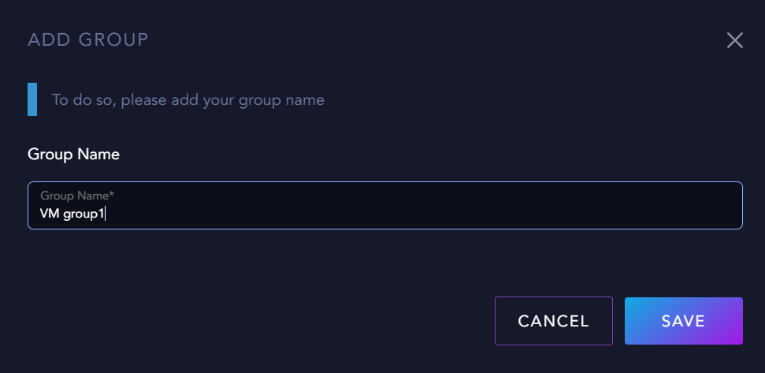
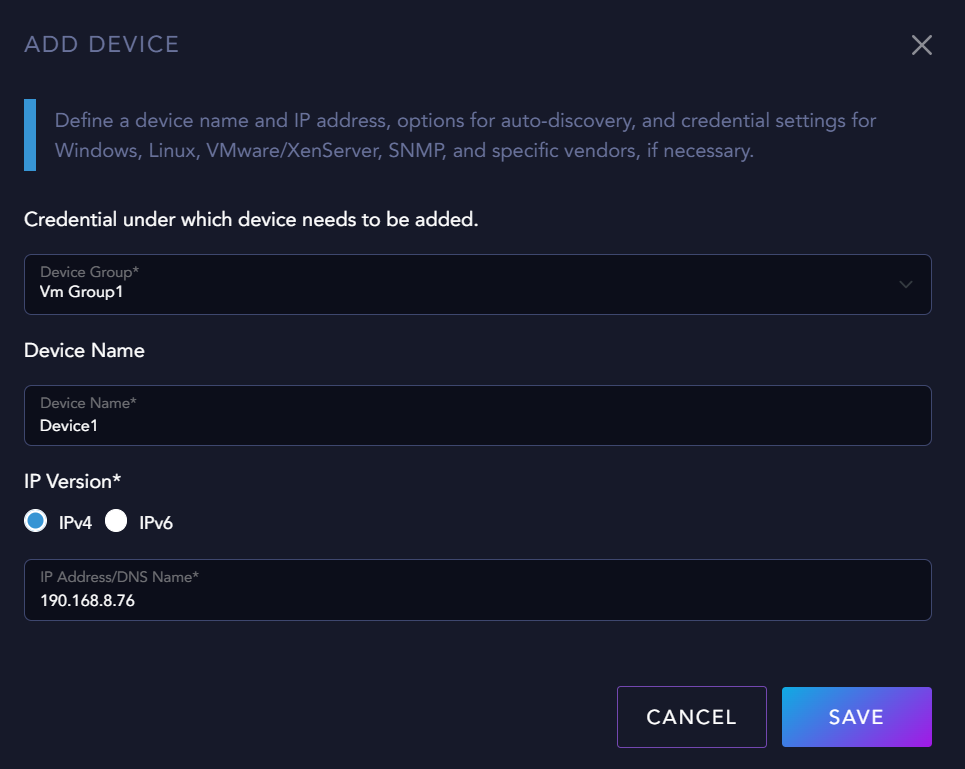

# Launching the internal UI for monitoring sensors

The MicroAI Network Monitor Login Interface provides access to the platform, allowing users to monitor and manage network activities effectively. By default, the local UI is accessible from:
**http://\<device IP>:8989/login**. Default username and password is **admin**.

**NOTE: This will only display if console is launched!**

The Local UI Console provides a graphical interface for managing and monitoring remote sensors, including:

- **HTTP URL Monitoring:** Tracks the availability and response of web services by checking specific URLs, HTTP response codes, request methods, and authentication details.
- **Service or Port Monitoring:** Monitors the status of network services by checking specific ports and IP addresses to ensure connectivity and availability.

To log in, users must enter their credentials and click the Login button. If authentication is successful, they will be redirected to the dashboard for network monitoring.

## Step 1: Adding Groups

Groups enable you to categorize and manage multiple systems with similar characteristics or that belong to the same environment.

To create a new group, navigate to the **GROUP** tab in the main navigation and click the **+** button to open the Add Group dialog. You'll need to provide a descriptive name for your group (such as "VM group1") that helps identify its purpose or the systems it will contain.

Once you've configured your group settings, click the **SAVE** button to create the group or **CANCEL** to discard your changes. Created groups will appear in the group management screen where they can be edited or deleted as needed.

## Step 2: Adding Devices

The **Add Device** feature lets you define systems for monitoring and management. To add a device, navigate to the **DEVICE** tab and click the **+** button to open the dialog.

Select the device group from the dropdown (e.g., "Vm Group1"). Enter a descriptive device name and select the IP version (IPv4 or IPv6) for communication. Enter the device's IP address or DNS name in the corresponding field.

Click **SAVE** to add the device to your inventory or **CANCEL** to discard changes. The added device will appear in the device management screen for monitoring and configuration.

## Step 3: Adding Sensors

The **Add Sensor** feature allows you to configure monitoring parameters for specific devices. To add a sensor, navigate to the **SENSOR** tab and click the **+** button to open the dialog.

Select the device you wish to monitor from the **Device** dropdown (e.g., "Device1"). Enter a descriptive name for your sensor in the **Sensor Name** field (e.g., "Google"). Choose the scanning interval that determines how frequently the sensor will be checked (e.g., "60 seconds").

Click **NEXT** to proceed with additional sensor configuration options or **CANCEL** to discard changes. The configured sensor will monitor the selected device according to the parameters you've specified.

### Monitoring Options

Here you have two monitoring options:

- **Port Monitor** - This sensor type assesses the availability and status of network ports. It consistently evaluates whether ports are "up" or "down" and provides real-time insights into network health, reliability, and performance.
- **URL Monitor** - This sensor type tracks the availability and status of web addresses. It ensures URLs are always "up" and provides insights into the overall health, performance, and reliability of online services.

For example, we will choose **URL Monitor**.

To monitor a URL, enter the desired link in the **URL** field (e.g., https://www.google.com/). Configure the **Request Timeout** in seconds to define how long the system should wait for a response before considering the URL unreachable (e.g., "10 seconds"). Specify the **Success Response Codes** that indicate a successful connection, such as "200" for OK. Choose the **Request Method**, like "GET," to determine how the system will request data from the URL. If authentication is required, provide the **User Name** and **Password** in the **Basic Authentication** section.

Finally, click **FINISH** to save the sensor configuration or **CANCEL** to discard any changes. The configured sensor will then monitor the specified URL based on the parameters you have set.

The table provides a clear overview of the health and status of all monitored resources. At a glance, you can identify which sensors are functioning normally and which ones are experiencing issues. In this screenshot, "Sensor2" is marked as "DOWN," indicating a potential problem that may require further investigation. By analyzing the table, you can quickly assess the overall system health, detect patterns, and prioritize troubleshooting efforts to maintain optimal performance. Additionally, historical data and trends can help in identifying recurring issues, enabling proactive maintenance and reducing system downtime.

## Monitoring Alert Thresholds

The **Monitoring Alert Threshold** feature allows you to configure performance and resource utilization limits that trigger system monitoring alerts. This enables proactive monitoring of critical system parameters.

Set specific thresholds for network traffic (upload and download), CPU usage, memory consumption, disk utilization, and disk usage. For each parameter, you can adjust the percentage or value at which an alert will be generated. The sliders provide an intuitive way to define these critical monitoring boundaries.

Key parameters include network traffic speeds (in mb/s), CPU percentage, memory percentage, disk utilization, and disk usage (Space). When any of these metrics exceed your configured thresholds, the system will generate an alert to notify administrators of potential performance issues or resource constraints.

Click **UPDATE** to save your configured thresholds or **CANCEL** to discard changes.

### Note:  
If you use the local UI to change any of these thresholds, the settings will override the values in the configuration file. This ensures that the most recent settings applied through the UI will be active for system monitoring.
