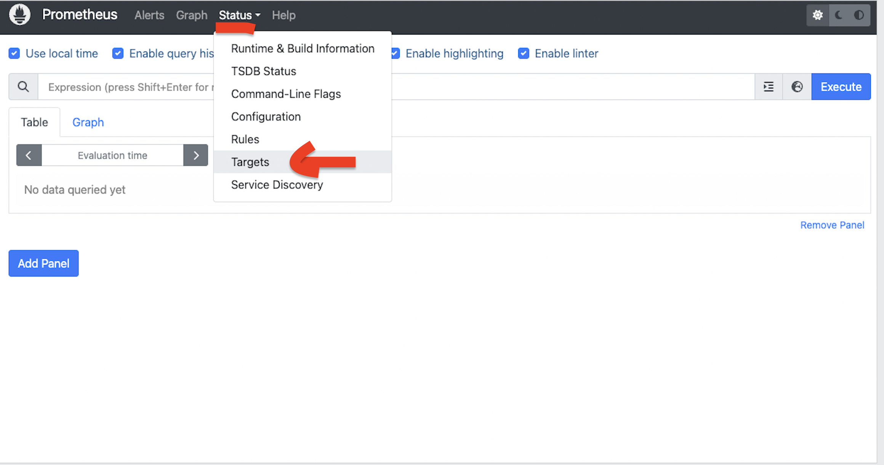
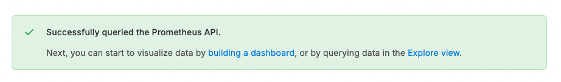
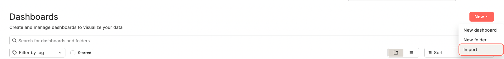
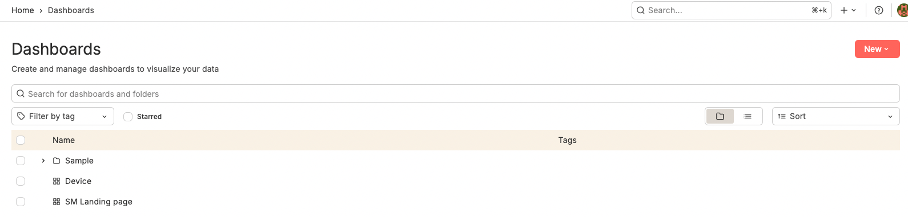
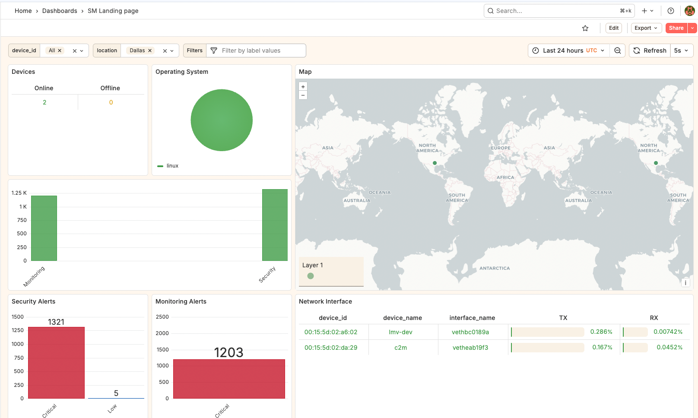
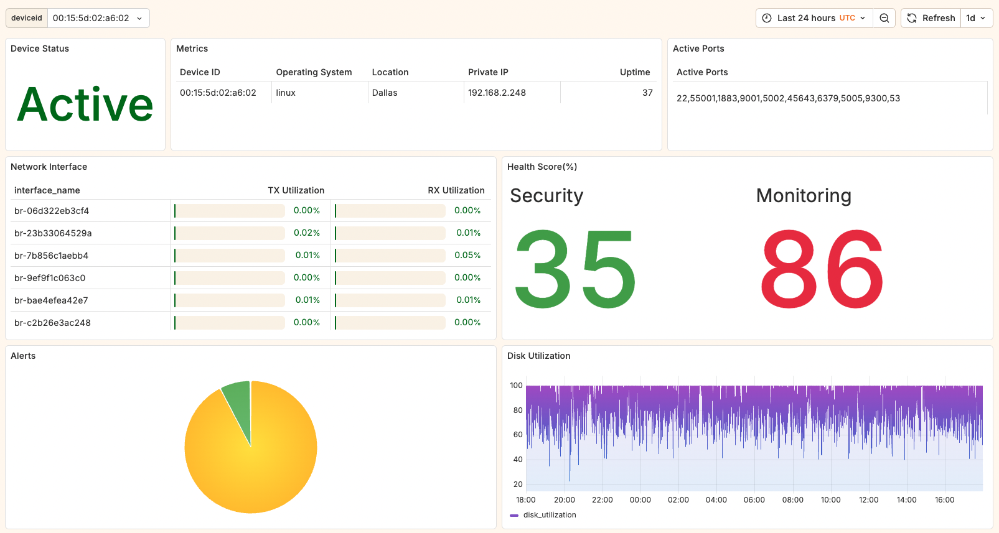

# Prometheus & Grafana Setup for MicroAI Security and Monitoring

## Table of Contents

* [1. Download and Install Prometheus Server](#1-download-and-install-prometheus-server)
* [2. Setup Prometheus Server](#2-setup-prometheus-server)
* [3. Verify Prometheus and Agent Connectivity](#3-verify-prometheus-and-agent-connectivity)
* [4. Connecting Grafana with Prometheus Server](#4-connecting-grafana-with-prometheus-server)
* [5. Visualizing Agent Data](#5-visualizing-agent-data)

---

## 1. Download and Install Prometheus Server

1. Visit the official Prometheus download page: [https://prometheus.io/download/](https://prometheus.io/download/) and download the package for your operating system.

### For Linux:

```bash
wget https://github.com/prometheus/prometheus/releases/download/v3.5.0/prometheus-3.5.0.linux-amd64.tar.gz
tar -xvf prometheus-3.5.0.linux-amd64.tar.gz
```

---

## 2. Setup Prometheus Server

All MicroAI Security and Monitoring Agents export Prometheus metrics on port `9100`.

1. Open the `prometheus.yml` configuration file.
2. Add a new job under the `scrape_configs` section with the agent IPs as targets.

### Example:

```yaml
scrape_configs:
  - job_name: "MicroAI-Security"
    static_configs:
      - targets: ["XXX.XXX.XXX.XXX:9100", "XXX.XXX.XXX.XXX:9100"]
```

3. Save and close the configuration file.

4. Ensure the Prometheus binary has execute permissions:

```bash
chmod +x prometheus
```

5. Start Prometheus:

```bash
./prometheus
```

---

## 3. Verify Prometheus and Agent Connectivity

1. Access the Prometheus web interface (default port `9090`):

```
http://XXX.XXX.XXX.XXX:9090/
```

2. Navigate to **Status** → **Targets**.
3. Verify that the MicroAI Security and Monitoring agent appears as **UP**.


---

## 4. Connecting Grafana with Prometheus Server

1. On the Grafana homepage, open the left panel.
2. Click on **Connections** → **Add new data source**.
3. Search for **Prometheus** and select it.
4. Under **Connection**, enter your Prometheus server URL:

```
http://XXX.XXX.XXX.XXX:9090
```

5. Click **Save & test**.
6. A confirmation message will indicate a successful connection.


---

## 5. Visualizing Agent Data

1. On the Grafana homepage, open the left panel.
2. Click **Dashboards** → **New** → **Import**.



3. Select the JSON dashboard files from the following path:

- [Device.json](./templates/Device.json)  
- [SM Landing Page.json](./templates/SM%20Landing%20page.json)  

4. Import the following dashboard files:

   * `Device.json`
   * `SM Landing page.json`

5. Once imported, you will see **Device** and **SM Landing Page** dashboards available.



6. Click on **SM Landing Page** to view the complete dashboard.





---

**Note:** These dashboards are pre-built templates that work out-of-the-box with data from the MicroAI Security and Monitoring agent via Prometheus.
