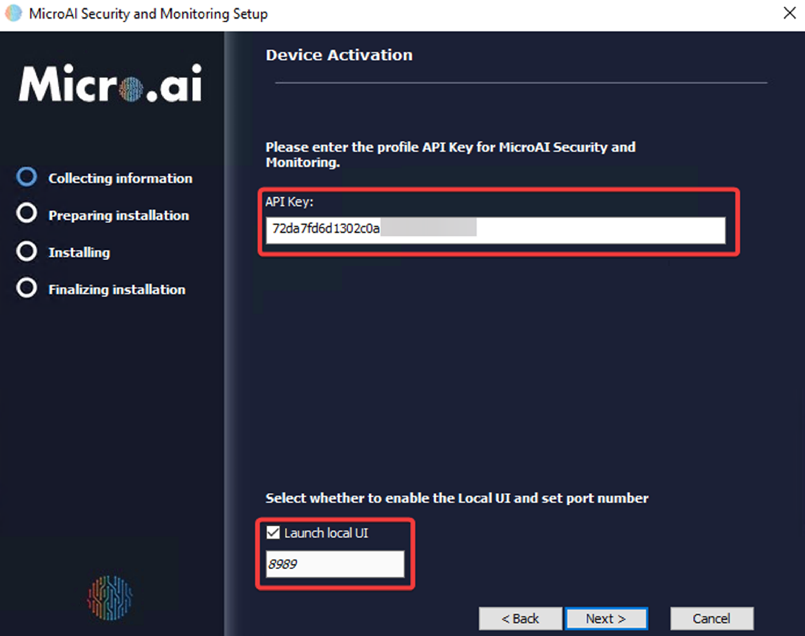

# Installation Walkthrough for Linux and Windows

In this section, we will walk through the installation process for a [Linux](#launching-microai-on-linux) environment and [Windows](#launching-microai-on-windows) environment.

## Launching MicroAI on Linux

The following screenshots illustrate an example of running MicroAI on Linux.

In the first screenshot, the agent is initialized and the device is activated, displaying the confirmation message: **"Device is activated successfully."** Once activated, the agent enters Training Mode, where the AI engine begins learning from the environment. A progress bar indicates the training status.  

In the second screenshot, the training reaches 100%, and the agent automatically switches to Execute Mode, as confirmed by the message: **"Training complete! Execute Mode set. Everything started."** At this stage, the agent is fully operational and ready for monitoring and security tasks.  

If the License key is invalid, the following error will be returned.  

If the device is registered under a different profile on Launchpad, the following error will occur. Please ensure that you are using the License key associated with the original account.  

---

## Launching MicroAI on Windows

The wizard is currently in the **"Collecting Information"** phase, highlighted in blue, with three subsequent stages: **"Preparing Installation," "Installing,"** and **"Finalizing Installation."** The user is prompted to proceed by clicking **"Next"** or to exit the setup by selecting **"Cancel."**  

### Prerequisites
Three prerequisites are listed, each marked with a checked checkbox, indicating they are selected for installation:
- **Npcap** (Version 1.0 or higher required)
- **Microsoft Windows Desktop Runtime - 7.0.0 (x86)**
- **Oracle Java SE Development Kit 17.0.1 x64** (Version 17.0.1 or higher required)

### End-User License Agreement
This image presents the **"End-User License Agreement"** screen of the MicroAI Security and Monitoring Setup Wizard.  

### Installation Path Selection
The interface presents the default installation path:  
📁 **C:\Program Files\MicroAI\MicroAI Security and Monitoring**  

Users can either:
- Accept the default path by clicking **"Next"**
- Specify a different location by manually entering a path or using the **"Browse..."** button

### Device Authentication
The user is required to enter their **License Key** to authenticate and connect the installation to the MicroAI Security and Monitoring platform. An example License key (**"72da7fd6d1302c0a159f6536f01f5e"**) is pre-filled in the input field.  

A reference image below the input field provides guidance on locating the License key within the **MicroAI Launchpad** interface.  
Additionally, the screen includes an option to **"Launch local UI,"** which is checked by default, with port **8989** specified for local access.  

### Installation Progress
The installation has now advanced to the **"Installing"** phase, which is highlighted in blue in the left navigation panel.  

### Windows Services Management
This image shows the **Windows Services** management console, where users can control and manage the **MicroAI Security and Monitoring service.** The service is currently **"Running"** with an **Automatic startup type,** ensuring it launches automatically with the system.  

