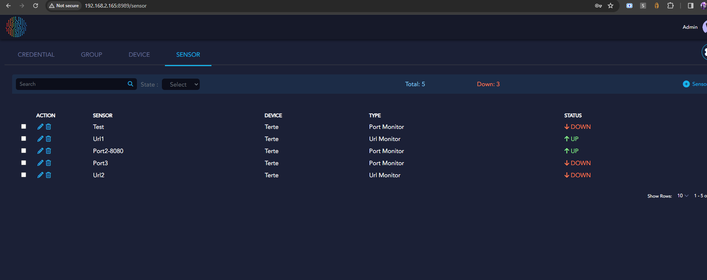

# MicroAI Security and Monitoring – Release Notes

## 2.2.17  

### Enhancements:  
- Enabled external access to Prometheus Exporter for improved monitoring integration.  

## 2.2.16  

### Bug Fixes:  
- Resolved an issue preventing multiple Device IDs from registering correctly under a single device.  

## 2.2.15  

### Enhancements:  
- Optimized the AI Nominal module to improve efficiency and performance.  
- Enabled FOTA (Firmware Over-The-Air) updates for Linux packages.  

### Bug Fixes:  
- Improved stability for port scanning detection.  

## 2.2.14  

### Enhancements:  
- Improved stability in monitoring services.  
- Enhanced Redis termination handling for Windows nodes.  
- Added proxy support for API and MQTT communications.  

### Bug Fixes:  
- Resolved stability issues with AI Nominal on Windows nodes.  

## 2.2.13  

### Enhancements:  
- URL monitoring now updates dynamically without requiring an agent restart.  
- UI now displays the total number of monitored URLs and their status (up/down).  

### Bug Fixes:  
- Improved stability for Windows-based monitoring services.  
- Resolved an issue where UI status remained blank until URL monitoring data was available.  
- Fixed log compression issues to reduce storage usage.  

## 2.2.12  

### Enhancements:  
- Updated the sensor module to provide real-time status updates for UI monitoring.  
    

## 2.2.11  

### Bug Fixes:  
- Resolved an issue where excessive log file generation caused system instability.  

## 2.2.10  

### Bug Fixes:  
- Fixed an issue retrieving gateway MAC addresses on specific devices.  
- Improved accuracy of training time calculations.  
- Optimized AI Nominal performance by limiting it to two CPU cores.  
- Increased overall stability of the security and monitoring package.  

## 2.2.9  

### Enhancements:  
- Introduced the Watcher module to monitor active services and processes.  

### Bug Fixes:  
- Resolved concurrent read/write issues affecting system stability.  
- Updated Redis builds for improved compatibility with Linux ARM64.  

## 2.2.8  

### Bug Fixes:  
- Fixed connection timeout issues with the Redis server.  
- Addressed an issue affecting sensor obfuscation.  

## 2.2.7  

### Enhancements:  
- Enabled advanced logging for Redis server activity.  

### Bug Fixes:  
- Fixed intermittent Redis server connection issues.  

## 2.2.6  

### Enhancements:  
- Windows installer now provides an option to launch the Local UI and configure a custom port.  

### Bug Fixes:  
- Improved AI Nominal stability.  
- Resolved crashes related to Redis timeout issues in AI Analytics.  

## 2.2.5  

### Enhancements:  
- Introduced a web UI for monitoring and managing sensors.  
- Java 17 or higher is now required for running the UI (packaged with the Windows installer).  
- Enhanced security monitoring by detecting network traffic at the Data Link and Ethernet layers.  
- Users can now update URLs, ports, and sensor configurations without restarting the agent.  
- Sensors now support custom scanning intervals for enhanced monitoring flexibility.  
- Added proxy support for MQTT traffic and self-activation.  
- Increased severity level for package removal alerts from Medium to Critical.  
- Displayed the registered device's IP address in the Launchpad device management page.  
- Users can enable/disable the local UI using the `-console` option, with default access at `localhost:8989` or a custom port via `-console.port <port>`.  

### Bug Fixes:  
- Resolved issues affecting Windows agent installation and removal.  
- Improved termination handling for background services.  
- Adjusted file permissions to allow configuration edits.  
- Improved agent stability across Windows and Linux.  
- Fixed false package removal alerts on Linux.  
- Resolved AI encryption/decryption inconsistencies.  
- Improved error handling for failed Launchpad API responses.  
