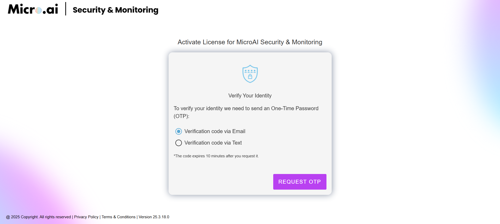
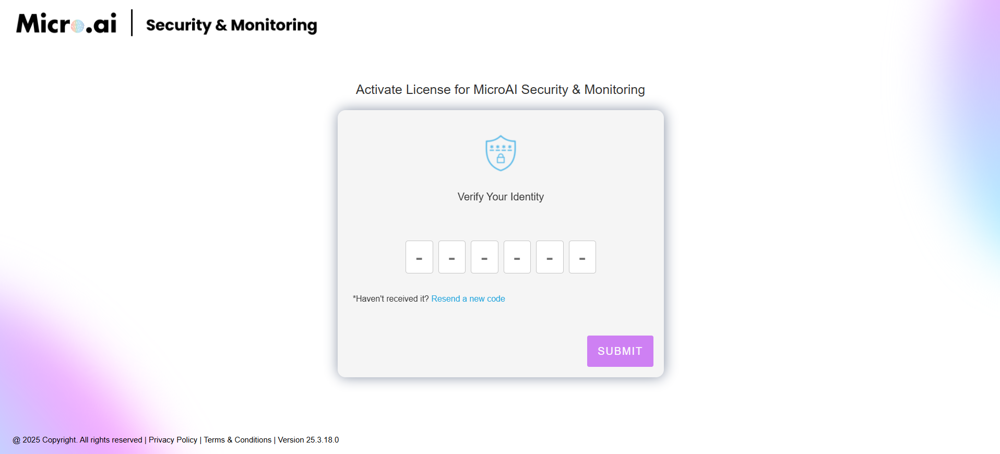

# Registration & License Key Retrieval Guide

Follow these steps to register and retrieve your license key for activation.

---

## **Step 1: Access the Registration Page**
Visit the registration page at **[MicroAI Launchpad](https://cloud-staging.onetech.ai/activate/campaign_March)** and enter the following details:
- **First Name**
- **Last Name**
- **Company Name**
- **Email Address**
- **Phone Number**

Click **Activate** to proceed.

---

## **Step 2: Choose OTP Delivery Method**
On the next page, select how you would like to receive your **One-Time Password (OTP):**
- **Email**
- **SMS**

Click **Request OTP** after selecting your preferred option.

---

## **Step 3: Enter Your OTP**
You will receive a **One-Time Password (OTP)** via your chosen method. Enter it in the field provided and click **Submit**.

If you did not receive the OTP, click **Resend OTP**.

---

## **Step 4: Retrieve Your License Key**
After successful verification, your **license key** will be displayed on the final page. This key will also be sent to your registered email.

Use this key to activate your software.

---

🔄 **Keep this license key safe!** You will need it for activation.

🚀 Happy using our software!

