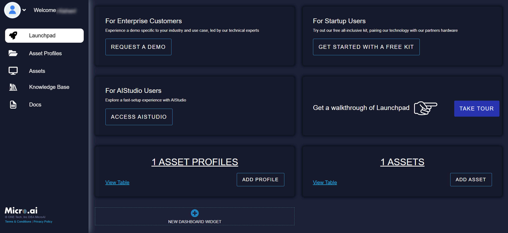
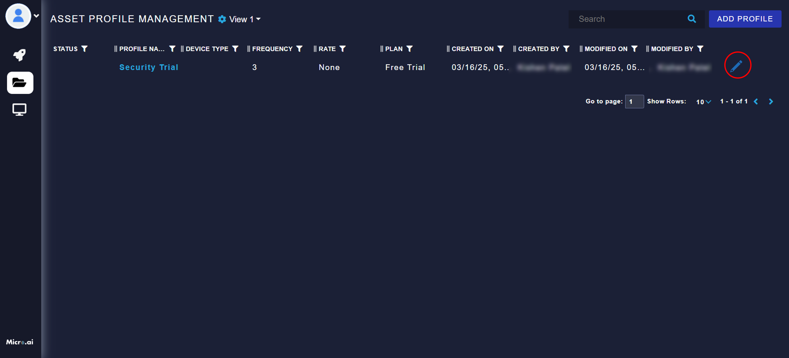
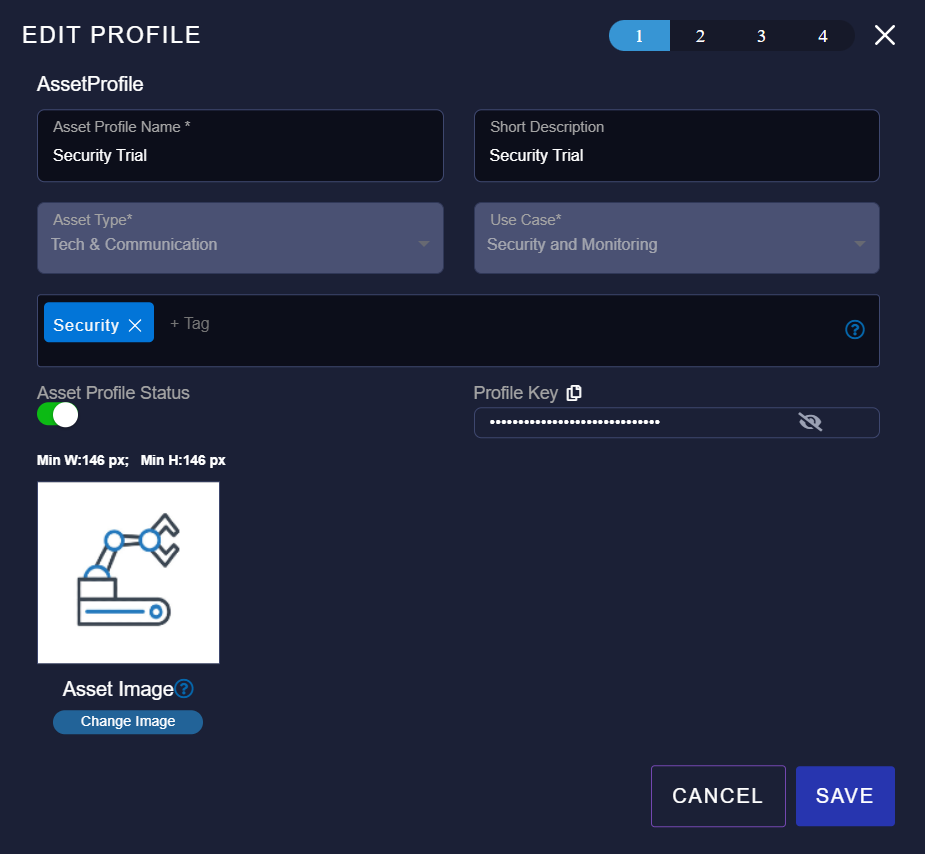
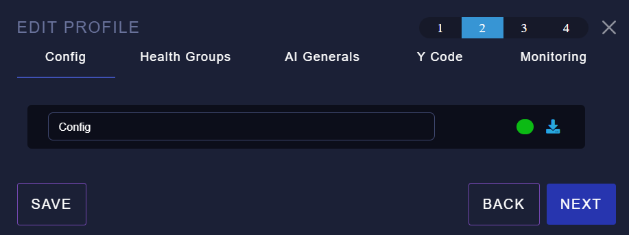
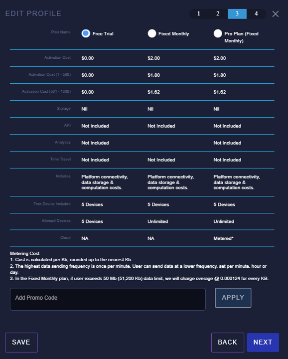
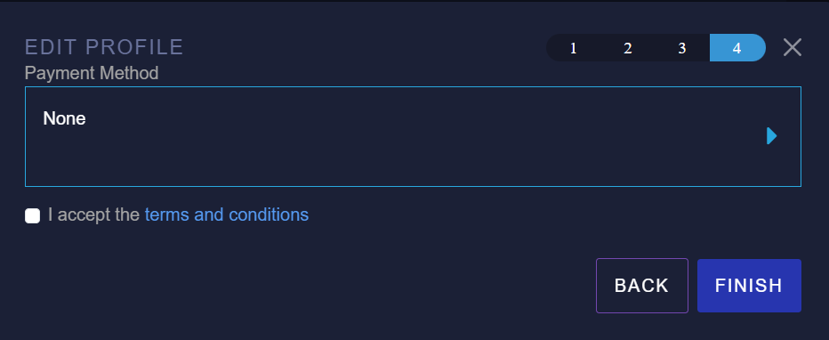

# Accessing Profile and Plan Details

Follow these steps to access and manage your profile and plan details on the MicroAI Launchpad.

### Step 1: Set Your Password

Access the [Launchpad Landing Page](https://launchpad.micro.ai/auth/login) and click on "Forgot Password."

Enter your email used during quick registration and follow the steps in the email to reset your password.

### Step 2: Log In to Launchpad

Once logged in, you will be greeted by the landing page.

### Step 3: Access Your Asset Profile

Click on **Asset Profiles** to view your current profile and plan details. Clicking on the **Edit (pencil icon)** allows you to view additional details.

#### Step 3.1: View and Update Device Details

The **Step 1** view displays device details, which can be updated.

#### Step 3.2: Update Configuration File

The **Step 2** view provides an interface to update the configuration file, which can be downloaded to modify agent settings.

#### Step 3.3: View and Modify Plan Details

The **Step 3** view displays your current plan details and provides options to update the plan.

#### Step 3.4: Add Payment Method

The **Step 4** view allows you to add a payment method. Once complete, click **Finish** to update your profile and plan settings.

